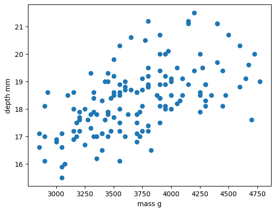
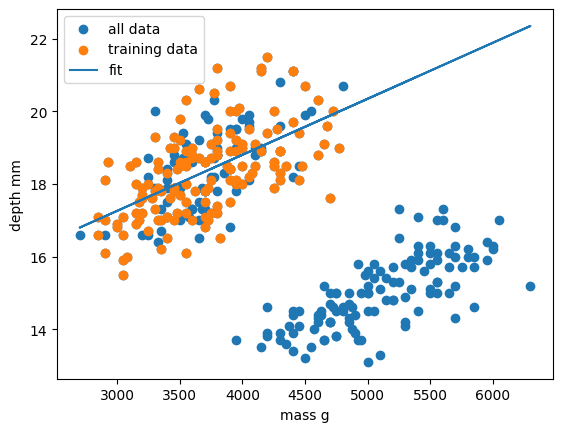

# Supervised learning

Classical machine learning is often divided into two categories – supervised and unsupervised learning.

For the case of supervised learning we act as a "supervisor" or "teacher" for our ML algorithms by providing the algorithm with "labelled data" that contains example answers of what we wish the algorithm to achieve.

For instance, if we wish to train our algorithm to distinguish between images of cats and dogs, we would provide our algorithm with images that have already been labelled as "cat" or "dog" so that it can learn from these examples. If we wished to train our algorithm to predict house prices over time we would provide our algorithm with example data of datetime values that are "labelled" with house prices.

Supervised learning is split up into two further categories: classification and regression. For classification the labelled data is discrete, such as the "cat" or "dog" example, whereas for regression the labelled data is continuous, such as the house price example.

In this episode we will explore how we can use regression to build a "model" that can be used to make predictions.

# Regression

Regression is a statistical technique that relates a dependent variable (a label in ML terms) to one or more independent variables (features in ML terms). A regression model attempts to describe this relation by fitting the data as closely as possible according to mathematical criteria. This model can then be used to predict new labelled values by inputting the independent variables into it. For example, if we create a house price model we can then feed in any datetime value we wish, and get a new house price value prediction.

Regression can be as simple as drawing a "line of best fit" through data points, known as linear regression, or more complex models such as polynomial regression, and is used routinely around the world in both industry and research. You may have already used regression in the past without knowing that it is also considered a machine learning technique!

## Linear regression using Scikit-Learn

We've had a lot of theory so time to start some actual coding! Let's create a regression model on some penguin data available through the Python plotting library [Seaborn](https://seaborn.pydata.org/). 

Let’s start by loading in and examining the penguin dataset, which containing a few hundred samples and a number of features and labels.

~~~
import seaborn as sns

dataset = sns.load_dataset("penguins")
dataset.head()
~~~
{: .language-python}

We can see that we have seven columns in total: 4 continuous (numerical) columns named `bill_length_mm`, `bill_depth_mm`, `flipper_length_mm`, and `body_mass_g`; and 3 discrete (categorical) columns named `species`, `island`, and `sex`. We can also see from a quick inspection of the first 5 samples that we have some missing data in the form of `NaN` values. Missing data is a fairly common occurrence in real-life data, so let's go ahead and remove any rows that contain `NaN` values:

~~~
dataset.dropna(inplace=True)
dataset.head()
~~~
{: .language-python}

In this scenario we will train a linear regression model using `body_mass_g` as our feature data and `bill_depth_mm` as our label data. We will train our model on a subset of the data by slicing the first 146 samples of our cleaned data. 

In machine learning we often train our models on a subset of data, for reasons we will explain later in this lesson, so let us extract a subset of data to work on by slicing the first 146 samples of our cleaned data and extracting our feature and label data:

~~~
import matplotlib.pyplot as plt

dataset_1 = dataset[:146]

x_data = dataset_1["body_mass_g"]
y_data = dataset_1["bill_depth_mm"]

plt.scatter(x_data, y_data)
plt.xlabel("mass g")
plt.ylabel("depth mm")
plt.show()
~~~
{: .language-python}

In this regression example we will create a Linear Regression model that will try to predict `y` values based upon `x` values.

In machine learning terminology: we will use our `x` feature (variable) and `y` labels(“answers”) to train our Linear Regression model to predict `y` values when provided with `x` values.

The mathematical equation for a linear fit is `y = mx + c` where `y` is our label data, `x` is our input feature(s), `m` represents the gradient of the linear fit, and `c` represents the intercept with the y-axis.

A typical ML workflow is as following:

* Decide on a model to use model (also known as an estimator)
* Tweak your data into the required format for your model
* Define and train your model on the input data
* Predict some values using the trained model
* Check the accuracy of the prediction, and visualise the result

We have already decided to use a linear regression model, so we’ll now pre-process our data into a format that Scikit-Learn can use.

~~~
import numpy as np

# sklearn requires a 2D array, so lets reshape our 1D arrays from (N) to (N,).
x_data = np.array(x_data).reshape(-1, 1)
y_data = np.array(y_data).reshape(-1, 1)
~~~
{: .language-python}

Next we’ll define a model, and train it on the pre-processed data. We’ll also inspect the trained model parameters m and c:

~~~
from sklearn.linear_model import LinearRegression

# Define our estimator/model
model = LinearRegression(fit_intercept=True)

# train our estimator/model using our data
lin_regress = model.fit(x_data,y_data)

# inspect the trained estimator/model parameters
m = lin_regress.coef_
c = lin_regress.intercept_
print("linear coefs=",m, c)
~~~
{: .language-python}

Now we can make predictions using our trained model, and calculate the Root Mean Squared Error (RMSE) of our predictions:

~~~
import math
from sklearn.metrics import mean_squared_error

# Predict some values using our trained estimator/model.
# In this case we predict our input data to evaluate accuracy!
linear_data = lin_regress.predict(x_data)

# calculated a RMS error as a quality of fit metric
error = math.sqrt(mean_squared_error(y_data, linear_data))
print("linear error=",error)
~~~
{: .language-python}

Finally, we’ll plot our input data, our linear fit, and our predictions:

~~~
plt.scatter(x_data, y_data, label="input")
plt.plot(x_data, linear_data, "-", label="fit")
plt.plot(x_data, linear_data, "rx", label="predictions")
plt.xlabel("body_mass_g")
plt.ylabel("bill_depth_mm")
plt.legend()
plt.show()
~~~
{: .language-python}

Congratulations! We've now created our first machine-learning model of the lesson and we can now make predictions of `bill_depth_mm` for any `body_mass_g` values that we pass into our model.

Let's provide the model with all of the penguin samples and see how our model performs on the full dataset:

~~~
# Extract the relevant features and labels from our complete dataset
x_data_all = dataset["body_mass_g"]
y_data_all = dataset["bill_depth_mm"]

# sklearn requires a 2D array, so lets reshape our 1D arrays from (N) to (N,).
x_data_all = np.array(x_data_all).reshape(-1, 1)
y_data_all = np.array(y_data_all).reshape(-1, 1)

# Predict values using our trained estimator/model from earlier
linear_data_all = lin_regress.predict(x_data_all)

# calculated a RMS error for all data
error_all = math.sqrt(mean_squared_error(y_data_all, linear_data_all))
print("linear error=",error_all)
~~~
{: .language-python}

Our RMSE for predictions on all penguin samples is far larger than before, so let's visually inspect the situation:

~~~
plt.scatter(x_data_all, y_data_all, label="all data")
plt.scatter(x_data, y_data, label="training data")

plt.plot(x_data_all, linear_data_all, label="fit")

plt.xlabel("mass g")
plt.ylabel("depth mm")
plt.legend()
plt.show()
~~~
{: .language-python}

Oh dear. It looks like our linear regression fits okay for our subset of the penguin data, and a few additional samples, but there appears to be a cluster of points that are poorly predicted by our model. Even if we re-trained our model using all samples it looks unlikely that our model would perform much better due to the two-cluster nature of our dataset.

> ## This is a classic Machine Learning scenario known as over-fitting
> We have trained our model on a specific set of data, and our model has learnt to reproduce those specific answers at the expense of creating a more generally-applicable model.
> Over fitting is the ML equivalent of learning an exam papers mark scheme off by heart, rather than understanding and answering the questions.
{: .callout}

In this episode we chose to create a regression model for `bill_depth_mm` versus `body_mass_g` predictions without understanding our penguin dataset. While we proved we *can* make a model by doing this we also saw that the model is flawed due to complexity in the data that we did not account for. 

With enough data and by using more complex regression models we *may* be able to create a generalisable `bill_depth_mm` versus `body_mass_g` model for penguins, but it's important to be aware that some problems simply might not be solvable with the data quantity or features that you have. 

In the next episode we will take a deeper dive into the penguin dataset as we attempt to create classification models for penguin species. 

## STUB FOR POLYNOMIAL SECTION

To be completed. This section will discuss how in machine learning non-linear problems are often converted into, or simply approximated by, linear representations. 

It will quickly go through the motions of a scikit-learn polynomial fit, mostly to focus on the typical ML workflow with additional data pre-processing for model compatability.


