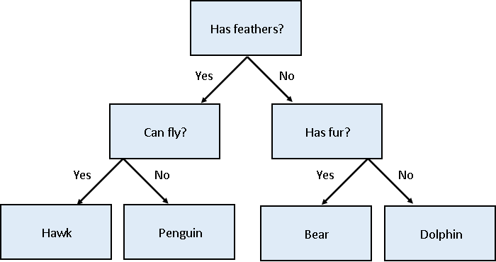
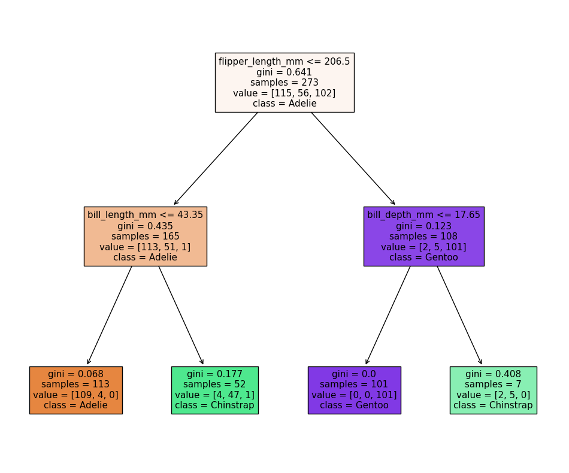
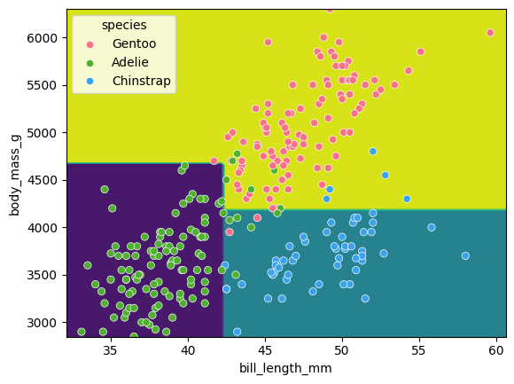

# Classification

Classification is a supervised method to recognise and group data objects into a pre-determined categories. Where regression uses labelled observations to predict a continuous numerical value, classification predicts a discrete categorical fit to a class. Classification in ML leverages a wide range of algorithms to classify a set of data/datasets into their respective categories.

In this episode we are going to introduce the concept of supervised classification by classifying penguin data into different species of penguins using Scikit-Learn.

## The penguins dataset
We're going to be using the penguins dataset of Allison Horst, published [here](https://github.com/allisonhorst/palmerpenguins) in 2020, which is comprised of 342 observations of three species of penguins: Adelie, Chinstrap & Gentoo. For each penguin we have measurements of bill length and depth (mm), flipper length (mm), body mass (g), and information on species, island, and sex.

~~~
import seaborn as sns

dataset = sns.load_dataset('penguins')
dataset.head()
~~~
{: .language-python}

Our aim is to develop a classification model that will predict the species of a penguin based upon measurements of those variables.

As a rule of thumb for ML/DL modelling, it is best to start with a simple model and progressively add complexity in order to meet our desired classification performance.

For this lesson we will limit our dataset to only numerical values such as bill_length, bill_depth, flipper_length, and body_mass while we attempt to classify species.

The above table contains multiple categorical objects such as species. If we attempt to include the other categorical fields, island and sex, we might hinder classification performance due to the complexity of the data.

## Training-testing split
When undertaking any machine learning project, it's important to be able to evaluate how well your model works. 

Rather than evaluating this manually we can instead set aside some of our training data, usually 20% of our training data, and use these as a testing dataset. We then train on the remaining 80% and use the testing dataset to evaluate the accuracy of our trained model. 

We lose a bit of training data in the process, But we can now easily evaluate the performance of our model. With more advanced test-train split techniques we can even recover this lost training data!

> ## Why do we do this?
> It's important to do this early, and to do all of your work with the training dataset - this avoids any risk of you introducing bias to the model based on your own manual observations of data in the testing set (afterall, we want the model to make the decisions about parameters!). This can also highlight when you are over-fitting on your training data.
{: .callout}

How we split the data into training and testing sets is also extremely important. We need to make sure that our training data is representitive of both our test data and actual data. 

For classification problems this means we should ensure that each class of interest is represented proportionately in both training and testing sets. For regression problems we should ensure that our training and test sets cover the range of feature values that we wish to predict.

In the previous regression episode we created the penguin training data by taking the first 146 samples our the dataset. Unfortunately the penguin data is sorted by species and so our training data only considered one type of penguin and thus was not representitive of the actual data we tried to fit. We could have avoided this issue by randomly shuffling our penguin samples before splitting the data.

> ## When not to shuffle your data
> Sometimes your data is dependant on it's ordering, such as time-series data where past values influence future predictions. Creating train-test splits for this can be tricky at first glance, but fortunately there are existing techniques to tackle this (often called stratification): See [Scikit-Learn](https://scikit-learn.org/stable/modules/cross_validation.html#cross-validation-iterators) for more information.
{: .callout}

Lets do some pre-processing on our dataset and specify our `X` features and `Y` labels:

~~~
# Extract the data we need
feature_names = ['bill_length_mm', 'bill_depth_mm', 'flipper_length_mm', 'body_mass_g']
dataset.dropna(subset=feature_names, inplace=True)

class_names = dataset['species'].unique()

X = dataset[feature_names]

Y = dataset['species']
~~~
{: .language-python}

Having extracted our features `X` and labels `y`, we can now split the data using the `train_test_split` function. We specify the fraction of data to use as test data, and the function randomly shuffles our data prior to splitting:

~~~
from sklearn.model_selection import train_test_split

x_train, x_test, y_train, y_test = train_test_split(X, Y, test_size=0.2, random_state=0)
~~~
{: .language-python}

We'll use `x_train` and `y_train` to develop our model, and only look at `x_test` and `y_test` when it's time to evaluate its performance.

### Visualising the data
In order to better understand how a model might classify this data, we can first take a look at the data visually, to see what patterns we might identify.

~~~
import matplotlib.pyplot as plt

fig01 = sns.scatterplot(x_train, x=feature_names[0], y=feature_names[1], hue=dataset['species'])
plt.show()
~~~
{: .language-python}

As there are four measurements for each penguin, we need quite a few plots to visualise all four dimensions against each other. Here is a handy Seaborn function to do so:

~~~
sns.pairplot(dataset, hue="species")
plt.show()
~~~
{: .language-python}

We can see that penguins from each species form fairly distinct spatial clusters in these plots, so that you could draw lines between those clusters to delineate each species. This is effectively what many classification algorithms do. They use the training data to delineate the observation space, in this case the 4 measurement dimensions, into classes. When given a new observation, the model finds which of those class areas the new observation falls in to.

## Classification using a decision tree
We'll first apply a decision tree classifier to the data. Decisions trees are conceptually similar to flow diagrams (or more precisely for the biologists: dichotomous keys). They split the classification problem into a binary tree of comparisons, at each step comparing a measurement to a value, and moving left or right down the tree until a classification is reached.

Training and using a decision tree in Scikit-Learn is straightforward:
~~~
from sklearn.tree import DecisionTreeClassifier, plot_tree

clf = DecisionTreeClassifier(max_depth=2)
clf.fit(x_train, y_train)

clf.predict(x_test)
~~~
{: .language-python}

> ## Hyper-parameters: parameters that tune a model
> 'Max Depth' is an example of a *hyper-parameter* for the decision tree model. Where models use the parameters of an observation to predict a result, hyper-parameters are used to tune how a model works. Each model you encounter will have its own set of hyper-parameters, each of which affects model behaviour and performance in a different way. The process of adjusting hyper-parameters in order to improve model performance is called hyper-parameter tuning.

We can conveniently check how our model did with the .score() function, which will make predictions and report what proportion of them were accurate:

~~~
clf_score = clf.score(x_test, y_test)
print(clf_score)
~~~
{: .language-python}

Our model reports an accuracy of ~98% on the test data! We can also look at the decision tree that was generated:

~~~
fig = plt.figure(figsize=(12, 10))
plot_tree(clf, class_names=class_names, feature_names=feature_names, filled=True, ax=fig.gca())
plt.show()
~~~
{: .language-python}

The first first question (`depth=1`) splits the training data into "Adelie" and "Gentoo" categories using the criteria `flipper_length_mm <= 206.5`, and the next two questions (`depth=2`) split the "Adelie" and "Gentoo" categories into "Adelie & Chinstrap" and "Gentoo & Chinstrap" predictions. 

<!-- We can see from this that there's some very tortuous logic being used to tease out every single observation in the training set. For example, the single purple Gentoo node at the bottom of the tree. If we truncated that branch to the second level (Chinstrap), we'd have a little inaccuracy, a total of 9 non-Chinstraps in with 48 Chinstraps, but a less convoluted model.

The tortuous logic, such as the bottom purple Gentoo node, is a clear indication that this model has been over-fitted. It has developed a very complex delineation of the classification space in order to match every single observation, which will likely lead to poor results for new observations.

We can see that rather than clean lines between species, the decision tree produces orthogonal regions as each decision only considers a single parameter. Again, we can see that the model is over-fitting as the decision space is far more complex than needed, with regions that only select a single point. -->

### Visualising the classification space
We can visualise the classification space (decision tree boundaries) to get a more intuitive feel for what it is doing.Note that our 2D plot can only show two parameters at a time, so we will quickly visualise by training a new model on only 2 features:

~~~
from sklearn.inspection import DecisionBoundaryDisplay

f1 = feature_names[0]
f2 = feature_names[3]

clf = DecisionTreeClassifier(max_depth=2)
clf.fit(x_train[[f1, f2]], y_train)

d = DecisionBoundaryDisplay.from_estimator(clf, x_train[[f1, f2]])

sns.scatterplot(x_train, x=f1, y=f2, hue=y_train, palette="husl")
plt.show()
~~~
{: .language-python}

## Tuning the `max_depth` hyperparameter

Our decision tree using a `max_depth=2` is fairly simple and there are still some incorrect predictions in our final classifications. Let's try varying the `max_depth` hyperparameter to see if we can improve our model predictions.

<!-- We can reduce the over-fitting of our decision tree model by limiting its depth, forcing it to use less decisions to produce a classification, and resulting in a simpler decision space. -->

~~~
import pandas as pd

max_depths = [1, 2, 3, 4, 5]

accuracy = []
for i, d in enumerate(max_depths):
    clf = DecisionTreeClassifier(max_depth=d)
    clf.fit(x_train, y_train)
    acc = clf.score(x_test, y_test)

    accuracy.append((d, acc))

acc_df = pd.DataFrame(accuracy, columns=['depth', 'accuracy'])

sns.lineplot(acc_df, x='depth', y='accuracy')
plt.xlabel('Tree depth')
plt.ylabel('Accuracy')
plt.show()
~~~
{: .language-python}

Here we can see that a `max_depth=2` performs slightly better on the test data than those with `max_depth > 2`. This can seem counter intuitive, as surely more questions should be able to better split up our categories and thus give better predictions?

Let's reuse our fitting and plotting codes from above to inspect a decision tree that has `max_depth=5`:

~~~
clf = DecisionTreeClassifier(max_depth=5)
clf.fit(x_train, y_train)

fig = plt.figure(figsize=(12, 10))
plot_tree(clf, class_names=class_names, feature_names=feature_names, filled=True, ax=fig.gca())
plt.show()
~~~
{: .language-python}

It looks like our decision tree has split up the training data into the correct penguin categories and more accurately than the `max_depth=2` model did, however it used some very specific questions to split up the penguins into the correct categories. Let's try visualising the classification space for a more intuitive understanding:
~~~
f1 = feature_names[0]
f2 = feature_names[3]

clf = DecisionTreeClassifier(max_depth=5)
clf.fit(x_train[[f1, f2]], y_train)

d = DecisionBoundaryDisplay.from_estimator(clf, x_train[[f1, f2]])

sns.scatterplot(x_train, x=f1, y=f2, hue=y_train, palette='husl')
plt.show()
~~~
{: .language-python}

Earlier we saw that the `max_depth=2` model split the data into 3 simple bounding boxes, whereas for `max_depth=5` we see the model has created some very specific classification boundaries to correctly classify every point in the training data.

This is a classic case of over-fitting - our model has produced extremely specific parameters that work for the training data but are not representitive of our test data. Sometimes simplicity is better!

## Classification using support vector machines
Next, we'll look at another commonly used classification algorithm, and see how it compares. Support Vector Machines (SVM) work in a way that is conceptually similar to your own intuition when first looking at the data. They devise a set of hyperplanes that delineate the parameter space, such that each region contains ideally only observations from one class, and the boundaries fall between classes.

### Normalising data
Unlike decision trees, SVMs require an additional pre-processing step for our data. We need to normalise it. Our raw data has parameters with different magnitudes such as bill length measured in 10's of mm's, whereas body mass is measured in 1000's of grams. If we trained an SVM directly on this data, it would only consider the parameter with the greatest variance (body mass).

Normalising maps each parameter to a new range so that it has a mean of 0 and a standard deviation of 1.

~~~
from sklearn import preprocessing
import pandas as pd

scalar = preprocessing.StandardScaler()
scalar.fit(x_train)
x_train_scaled = pd.DataFrame(scalar.transform(x_train), columns=x_train.columns, index=x_train.index)
x_test_scaled = pd.DataFrame(scalar.transform(x_test), columns=x_test.columns, index=x_test.index)
~~~
{: .language-python}

Note that we fit the scalar to our training data - we then use this same pre-trained scalar to transform our testing data.

With this scaled data, training the models works exactly the same as before.

~~~
from sklearn import svm

SVM = svm.SVC(kernel='poly', degree=3, C=1.5)
SVM.fit(x_train_scaled, y_train)

svm_score = SVM.score(x_test_scaled, y_test)
print("Decision tree score is ", clf_score)
print("SVM score is ", svm_score)
~~~
{: .language-python}

We can again visualise the decision space produced, also using only two parameters:

~~~
x2 = x_train_scaled[[feature_names[0], feature_names[1]]]

SVM = svm.SVC(kernel='poly', degree=3, C=1.5)
SVM.fit(x2, y_train)

DecisionBoundaryDisplay.from_estimator(SVM, x2) #, ax=ax
sns.scatterplot(x2, x=feature_names[0], y=feature_names[1], hue=dataset['species'])
plt.show()
~~~
{: .language-python}

While this SVM model performs slightly worse than our decision tree (95.6% vs. 98.5%), it's likely that the non-linear boundaries will perform better when exposed to more and more real data, as decision trees are prone to overfitting and requires complex linear models to reproduce simple non-linear boundaries. It's important to pick a model that is appropriate for your problem and data trends!

{: .callout}
